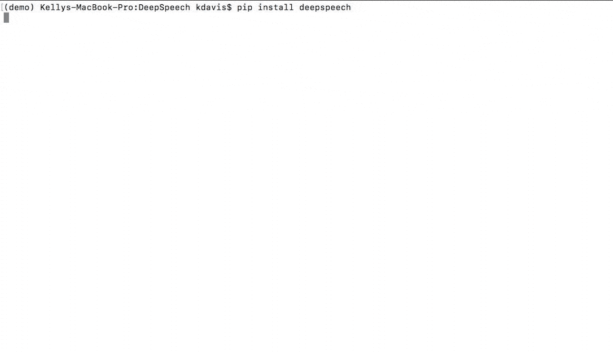

# Project DeepSpeech

[](http://deepspeech.readthedocs.io/?badge=master)
[](https://github.taskcluster.net/v1/repository/mozilla/DeepSpeech/master/latest)

Project DeepSpeech is an open source Speech-To-Text engine, using a model trained by machine learning techniques, based on [Baidu's Deep Speech research paper](https://arxiv.org/abs/1412.5567). Project DeepSpeech uses Google's [TensorFlow](https://www.tensorflow.org/) project to make the implementation easier.



Pre-built binaries that can be used for performing inference with a trained model can be installed with `pip3`. Proper setup using virtual environment is recommended and you can find that documented [below](#using-the-python-package).

A pre-trained English model is available for use, and can be downloaded using [the instructions below](#getting-the-pre-trained-model).

Once everything is installed you can then use the `deepspeech` binary to do speech-to-text on short, approximately 5 second, audio files (currently only WAVE files with 16-bit, 16 kHz, mono are supported in the Python client):

```bash
pip3 install deepspeech
deepspeech --model models/output_graph.pbmm --alphabet models/alphabet.txt --lm models/lm.binary --trie models/trie --audio my_audio_file.wav
```

Alternatively, quicker inference (The realtime factor on a GeForce GTX 1070 is about 0.44.) can be performed using a supported NVIDIA GPU on Linux. (See the release notes to find which GPU's are supported.) This is done by instead installing the GPU specific package:

```bash
pip3 install deepspeech-gpu
deepspeech --model models/output_graph.pbmm --alphabet models/alphabet.txt --lm models/lm.binary --trie models/trie --audio my_audio_file.wav
```

See the output of `deepspeech -h` for more information on the use of `deepspeech`. (If you experience problems running `deepspeech`, please check [required runtime dependencies](native_client/README.md#required-dependencies)).

**Table of Contents**

- [Prerequisites](#prerequisites)
- [Getting the code](#getting-the-code)
- [Getting the pre-trained model](#getting-the-pre-trained-model)
- [Using the model](#using-the-model)
  - [Using the Python package](#using-the-python-package)
  - [Using the command line client](#using-the-command-line-client)
  - [Using the Node.JS package](#using-the-nodejs-package)
  - [Installing bindings from source](#installing-bindings-from-source)
  - [Third party bindings](#third-party-bindings)
- [Training](#training)
  - [Installing prerequisites for training](#installing-prerequisites-for-training)
  - [Recommendations](#recommendations)
  - [Common Voice training data](#common-voice-training-data)
  - [Training a model](#training-a-model)
  - [Checkpointing](#checkpointing)
  - [Exporting a model for inference](#exporting-a-model-for-inference)
  - [Distributed computing across more than one machine](#distributed-training-across-more-than-one-machine)
  - [Continuing training from a frozen graph](#continuing-training-from-a-frozen-graph)
- [Code documentation](#code-documentation)
- [Contact/Getting Help](#contactgetting-help)

## Prerequisites

* [Python 3.6](https://www.python.org/)
* [Git Large File Storage](https://git-lfs.github.com/)

## Getting the code

Install [Git Large File Storage](https://git-lfs.github.com/), either manually or through a package like `git-lfs` if available on your system. Then clone the DeepSpeech repository normally:

```bash
git clone https://github.com/mozilla/DeepSpeech
```

## Getting the pre-trained model

If you want to use the pre-trained English model for performing speech-to-text, you can download it (along with other important inference material) from the [DeepSpeech releases page](https://github.com/mozilla/DeepSpeech/releases). Alternatively, you can run the following command to download and unzip the files in your current directory:

```bash
wget -O - https://github.com/mozilla/DeepSpeech/releases/download/v0.1.1/deepspeech-0.1.1-models.tar.gz | tar xvfz -
```

## Using the model

There are three ways to use DeepSpeech inference:

- [The Python package](#using-the-python-package)
- [The command-line client](#using-the-command-line-client)
- [The Node.JS package](#using-the-nodejs-package)


### Using the Python package

Pre-built binaries that can be used for performing inference with a trained model can be installed with `pip3`. You can then use the `deepspeech` binary to do speech-to-text on an audio file:

For the Python bindings, it is highly recommended that you perform the installation within a Python 3.5 or later virtual environment. You can find more information about those in [this documentation](http://docs.python-guide.org/en/latest/dev/virtualenvs/).
We will continue under the assumption that you already have your system properly setup to create new virtual environments.

#### Create a DeepSpeech virtual environment

In creating a virtual environment you will create a directory containing a `python3` binary and everything needed to run deepspeech. You can use whatever directory you want. For the purpose of the documentation, we will rely on `$HOME/tmp/deepspeech-venv`. You can create it using this command:

```
$ virtualenv -p python3 $HOME/tmp/deepspeech-venv/
```

Once this command completes successfully, the environment will be ready to be activated.

#### Activating the environment

Each time you need to work with DeepSpeech, you have to *activate*, *load* this virtual environment. This is done with this simple command:

```
$ source $HOME/tmp/deepspeech-venv/bin/activate
```

#### Installing DeepSpeech Python bindings

Once your environment has been setup and loaded, you can use `pip3` to manage packages locally. On a fresh setup of the virtualenv, you will have to install the DeepSpeech wheel. You can check if it is already installed by taking a look at the output of `pip3 list`. To perform the installation, just issue:

```
$ pip3 install deepspeech
```

If it is already installed, you can also update it:
```
$ pip3 install --upgrade deepspeech
```

Alternatively, if you have a supported NVIDIA GPU on Linux (See the release notes to find which GPU's are supported.), you can install the GPU specific package as follows:

```
$ pip3 install deepspeech-gpu
```

or update it as follows:
```
$ pip3 install --upgrade deepspeech-gpu
```

In both cases, it should take care of installing all the required dependencies. Once it is done, you should be able to call the sample binary using `deepspeech` on your command-line.

Note: the following command assumes you [downloaded the pre-trained model](#getting-the-pre-trained-model).

```bash
deepspeech --model models/output_graph.pbmm --alphabet models/alphabet.txt --lm models/lm.binary --trie models/trie --audio my_audio_file.wav
```

The last two arguments are optional, and represent a language model.

See [client.py](native_client/python/client.py) for an example of how to use the package programatically.

### Using the command-line client

To download the pre-built binaries, use `util/taskcluster.py`:

```bash
python3 util/taskcluster.py --target .
```

or if you're on macOS:

```bash
python3 util/taskcluster.py --arch osx --target .
```

also, if you need some binaries different than current master, like `v0.2.0-alpha.6`, you can use `--branch`:
```bash
python3 util/taskcluster.py --branch "v0.2.0-alpha.6 --target ."
```

This will download `native_client.tar.xz` which includes the deepspeech binary and associated libraries, and extract it into the current folder. `taskcluster.py` will download binaries for Linux/x86_64 by default, but you can override that behavior with the `--arch` parameter. See the help info with `python util/taskcluster.py -h` for more details. Proper DeepSpeech or TensorFlow's branch can be specified as well.

Note: the following command assumes you [downloaded the pre-trained model](#getting-the-pre-trained-model).

```bash
./deepspeech --model models/output_graph.pbmm --alphabet models/alphabet.txt --lm models/lm.binary --trie models/trie --audio audio_input.wav
```


See the help output with `./deepspeech -h` and the [native client README](native_client/README.md) for more details.

### Using the Node.JS package

You can download the Node.JS bindings using `npm`:

```bash
npm install deepspeech
```

Alternatively, if you're using Linux and have a supported NVIDIA GPU (See the release notes to find which GPU's are supported.), you can install the GPU specific package as follows:

```bash
npm install deepspeech-gpu
```

See [client.js](native_client/javascript/client.js) for an example of how to use the bindings.

### Installing bindings from source

If pre-built binaries aren't available for your system, you'll need to install them from scratch. Follow [these instructions](native_client/README.md).

### Third party bindings

In addition to the bindings above, third party developers have started to provide bindings to other languages:

* [Asticode](https://github.com/asticode) provides [Golang](https://golang.org) bindings in its [go-astideepspeech](https://github.com/asticode/go-astideepspeech) repo.
* [RustAudio](https://github.com/RustAudio) provide a [Rust](https://www.rust-lang.org) binding, the installation and use of which is described in their [deepspeech-rs](https://github.com/RustAudio/deepspeech-rs) repo.
* [stes](https://github.com/stes) provides preliminary [PKGBUILDs](https://wiki.archlinux.org/index.php/PKGBUILD) to install the client and python bindings on [Arch Linux](https://www.archlinux.org/) in the [arch-deepspeech](https://github.com/stes/arch-deepspeech) repo.
* [gst-deepspeech](https://github.com/Elleo/gst-deepspeech) provides a [GStreamer](https://gstreamer.freedesktop.org/) plugin which can be used from any language with GStreamer bindings.

## Training

### Installing prerequisites for training

Install the required dependencies using pip:

```bash
cd DeepSpeech
pip3 install -r requirements.txt
```

You'll also need to download `native_client.tar.xz` or build the native client files yourself to get the custom TensorFlow OP needed for decoding the outputs of the neural network. You can use `util/taskcluster.py` to download the files for your architecture:

```bash
python3 util/taskcluster.py --target .
```

This will download the native client files for the x86_64 architecture without CUDA support, and extract them into the current folder. If you prefer building the binaries from source, see the [native_client README file](native_client/README.md). We also have binaries with CUDA enabled ("--arch gpu") and for ARM7 ("--arch arm").

### Recommendations

If you have a capable (Nvidia, at least 8GB of VRAM) GPU, it is highly recommended to install TensorFlow with GPU support. Training will likely be significantly quicker than using the CPU. To enable GPU support, you can do:

```bash
pip3 uninstall tensorflow
pip3 install 'tensorflow-gpu==1.6.0'
```

### Common Voice training data

The Common Voice corpus consists of voice samples that were donated through [Common Voice](https://voice.mozilla.org/).
We provide an importer, that automates the whole process of downloading and preparing the corpus.
You just specify a target directory where all Common Voice contents should go.
If you already downloaded the Common Voice corpus archive from [here](https://voice.mozilla.org/data), you can simply run the import script on the directory where the corpus is located.
The importer will then skip downloading it and immediately proceed to unpackaging and importing.
To start the import process, you can call:

```bash
bin/import_cv.py path/to/target/directory
```

Please be aware that this requires at least 70GB of free disk space and quite some time to conclude.
As this process creates a huge number of small files, using an SSD drive is highly recommended.
If the import script gets interrupted, it will try to continue from where it stopped the next time you run it.
Unfortunately, there are some cases where it will need to start over.
Once the import is done, the directory will contain a bunch of CSV files.

The following files are official user-validated sets for training, validating and testing:

- `cv-valid-train.csv`
- `cv-valid-dev.csv`
- `cv-valid-test.csv`

The following files are the non-validated unofficial sets for training, validating and testing:

- `cv-other-train.csv`
- `cv-other-dev.csv`
- `cv-other-test.csv`

`cv-invalid.csv` contains all samples that users flagged as invalid.

A sub-directory called `cv_corpus_{version}` contains the mp3 and wav files that were extracted from an archive named `cv_corpus_{version}.tar.gz`.
All entries in the CSV files refer to their samples by absolute paths. So moving this sub-directory would require another import or tweaking the CSV files accordingly.

To use Common Voice data during training, validation and testing, you pass (comma separated combinations of) their filenames into `--train_files`, `--dev_files`, `--test_files` parameters of `DeepSpeech.py`.
If, for example, Common Voice was imported into `../data/CV`, `DeepSpeech.py` could be called like this:

```bash
./DeepSpeech.py --train_files ../data/CV/cv-valid-train.csv --dev_files ../data/CV/cv-valid-dev.csv --test_files ../data/CV/cv-valid-test.csv
```

If you are brave enough, you can also include the `other` dataset, which contains not-yet-validated content, and thus can be broken from time to time:

```bash
./DeepSpeech.py --train_files ../data/CV/cv-valid-train.csv,../data/CV/cv-other-train.csv --dev_files ../data/CV/cv-valid-dev.csv --test_files ../data/CV/cv-valid-test.csv
```

### Training a model

The central (Python) script is `DeepSpeech.py` in the project's root directory. For its list of command line options, you can call:

```bash
./DeepSpeech.py --help
```

To get the output of this in a slightly better-formatted way, you can also look up the option definitions top of `DeepSpeech.py`.

For executing pre-configured training scenarios, there is a collection of convenience scripts in the `bin` folder. Most of them are named after the corpora they are configured for. Keep in mind that the other speech corpora are *very large*, on the order of tens of gigabytes, and some aren't free. Downloading and preprocessing them can take a very long time, and training on them without a fast GPU (GTX 10 series recommended) takes even longer.

**If you experience GPU OOM errors while training, try reducing the batch size with the `--train_batch_size`, `--dev_batch_size` and `--test_batch_size` parameters.**

As a simple first example you can open a terminal, change to the directory of the DeepSpeech checkout and run:

```bash
./bin/run-ldc93s1.sh
```

This script will train on a small sample dataset called LDC93S1, which can be overfitted on a GPU in a few minutes for demonstration purposes. From here, you can alter any variables with regards to what dataset is used, how many training iterations are run and the default values of the network parameters.
Feel also free to pass additional (or overriding) `DeepSpeech.py` parameters to these scripts.
Then, just run the script to train the modified network.

Each dataset has a corresponding importer script in `bin/` that can be used to download (if it's freely available) and preprocess the dataset. See `bin/import_librivox.py` for an example of how to import and preprocess a large dataset for training with Deep Speech.

If you've run the old importers (in `util/importers/`), they could have removed source files that are needed for the new importers to run. In that case, simply remove the extracted folders and let the importer extract and process the dataset from scratch, and things should work.

### Checkpointing

During training of a model so-called checkpoints will get stored on disk. This takes place at a configurable time interval. The purpose of checkpoints is to allow interruption (also in the case of some unexpected failure) and later continuation of training without losing hours of training time. Resuming from checkpoints happens automatically by just (re)starting training with the same `--checkpoint_dir` of the former run.

Be aware however that checkpoints are only valid for the same model geometry they had been generated from. In other words: If there are error messages of certain `Tensors` having incompatible dimensions, this is most likely due to an incompatible model change. One usual way out would be to wipe all checkpoint files in the checkpoint directory or changing it before starting the training.

### Exporting a model for inference

If the `--export_dir` parameter is provided, a model will have been exported to this directory during training.
Refer to the corresponding [README.md](native_client/README.md) for information on building and running a client that can use the exported model.

### Making a mmap-able model for inference

The `output_graph.pb` model file generated in the above step will be loaded in memory to be dealt with when running inference.
This will result in extra loading time and memory consumption. One way to avoid this is to directly read data from the disk.

TensorFlow has tooling to achieve this: it requires building the target `//tensorflow/contrib/util:convert_graphdef_memmapped_format` (binaries are produced by our TaskCluster for some systems including Linux/amd64 and macOS/amd64), use `util/taskcluster.py` tool to download, specifying `tensorflow` as a source.
Producing a mmap-able model is as simple as:
```
$ convert_graphdef_memmapped_format --in_graph=output_graph.pb --out_graph=output_graph.pbmm
```

Upon sucessfull run, it should report about conversion of a non zero number of nodes. If it reports converting 0 nodes, something is wrong: make sure your model is a frozen one, and that you have not applied any incompatible changes (this includes `quantize_weights`).

### Distributed training across more than one machine

DeepSpeech has built-in support for [distributed TensorFlow](https://www.tensorflow.org/deploy/distributed). To get an idea on how this works, you can use the script `bin/run-cluster.sh` for running a cluster with workers just on the local machine.

```bash
$ bin/run-cluster.sh --help
Usage: run-cluster.sh [--help] [--script script] [p:w:g] <arg>*

--help      print this help message
--script    run the provided script instead of DeepSpeech.py
p           number of local parameter servers
w           number of local workers
g           number of local GPUs per worker
<arg>*      remaining parameters will be forwarded to DeepSpeech.py or a provided script

Example usage - The following example will create a local DeepSpeech.py cluster
with 1 parameter server, and 2 workers with 1 GPU each:
$ run-cluster.sh 1:2:1 --epoch 10
```

Be aware that for the help example to be able to run, you need at least two `CUDA` capable GPUs (2 workers times 1 GPU). The script utilizes environment variable `CUDA_VISIBLE_DEVICES` for `DeepSpeech.py` to see only the provided number of GPUs per worker.
The script is meant to be a template for your own distributed computing instrumentation. Just modify the startup code for the different servers (workers and parameter servers) accordingly. You could use SSH or something similar for running them on your remote hosts.

### Continuing training from a frozen graph

If you'd like to use one of the pre-trained models released by Mozilla to bootstrap your training process (transfer learning, fine tuning), you can do so by using the `--initialize_from_frozen_model` flag in `DeepSpeech.py`. For best results, make sure you're passing an empty `--checkpoint_dir` when resuming from a frozen model.

For example, if you want to fine tune the entire graph using your own data in `my-train.csv`, `my-dev.csv` and `my-test.csv`, for three epochs, you can something like the following, tuning the hyperparameters as needed:

```bash
mkdir fine_tuning_checkpoints
python3 DeepSpeech.py --n_hidden 2048 --initialize_from_frozen_model path/to/model/output_graph.pb --checkpoint_dir fine_tuning_checkpoints --epoch 3 --train_files my-train.csv --dev_files my-dev.csv --test_files my_dev.csv --learning_rate 0.0001
```

Note: the released models were trained with `--n_hidden 2048`, so you need to use that same value when initializing from the release models.

## Code documentation

Documentation (incomplete) for the code can be found here: http://deepspeech.readthedocs.io/en/latest/

## Contact/Getting Help

There are several ways to contact us or to get help:

1. [**FAQ**](https://github.com/mozilla/DeepSpeech/wiki#frequently-asked-questions) - We have a list of common questions, and their answers, in our [FAQ](https://github.com/mozilla/DeepSpeech/wiki#frequently-asked-questions). When just getting started, it's best to first check the [FAQ](https://github.com/mozilla/DeepSpeech/wiki#frequently-asked-questions) to see if your question is addressed.

2. [**Discourse Forums**](https://discourse.mozilla.org/c/deep-speech) - If your question is not addressed in the [FAQ](https://github.com/mozilla/DeepSpeech/wiki#frequently-asked-questions), the [Discourse Forums](https://discourse.mozilla.org/c/deep-speech) is the next place to look. They contain conversations on [General Topics](https://discourse.mozilla.org/t/general-topics/21075), [Using Deep Speech](https://discourse.mozilla.org/t/using-deep-speech/21076/4), and [Deep Speech Development](https://discourse.mozilla.org/t/deep-speech-development/21077).

3. [**IRC**](https://wiki.mozilla.org/IRC) - If your question is not addressed by either the [FAQ](https://github.com/mozilla/DeepSpeech/wiki#frequently-asked-questions) or [Discourse Forums](https://discourse.mozilla.org/c/deep-speech), you can contact us on the `#machinelearning` channel on [Mozilla IRC](https://wiki.mozilla.org/IRC); people there can try to answer/help

4. [**Issues**](https://github.com/mozilla/deepspeech/issues) - Finally, if all else fails, you can open an issue in our repo.
