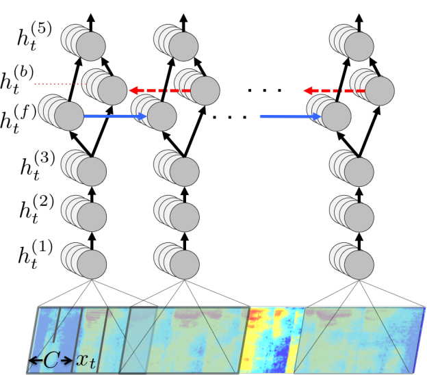

Introduction
============

In this project we will reproduce the results of
`Deep Speech: Scaling up end-to-end speech recognition <http://arxiv.org/abs/1412.5567>`_.
The core of the system is a bidirectional recurrent neural network (BRNN)
trained to ingest speech spectrograms and generate English text transcriptions.

Let a single utterance :math:`x` and label :math:`y` be sampled from a training set

.. math::
    S = \{(x^{(1)}, y^{(1)}), (x^{(2)}, y^{(2)}), . . .\}.

Each utterance, :math:`x^{(i)}` is a time-series of length :math:`T^{(i)}`
where every time-slice is a vector of audio features,
:math:`x^{(i)}_t` where :math:`t=1,\ldots,T^{(i)}`.
We use MFCC as our features; so :math:`x^{(i)}_{t,p}` denotes the :math:`p`-th MFCC feature
in the audio frame at time :math:`t`. The goal of our BRNN is to convert an input
sequence :math:`x` into a sequence of character probabilities for the transcription
:math:`y`, with :math:`\hat{y}_t =\mathbb{P}(c_t \mid x)`,
where :math:`c_t \in \{a,b,c, . . . , z, space, apostrophe, blank\}`.
(The significance of :math:`blank` will be explained below.)

Our BRNN model is composed of :math:`5` layers of hidden units.
For an input :math:`x`, the hidden units at layer :math:`l` are denoted :math:`h^{(l)}` with the
convention that :math:`h^{(0)}` is the input. The first three layers are not recurrent.
For the first layer, at each time :math:`t`, the output depends on the MFCC frame
:math:`x_t` along with a context of :math:`C` frames on each side.
(We typically use :math:`C \in \{5, 7, 9\}` for our experiments.)
The remaining non-recurrent layers operate on independent data for each time step.
Thus, for each time :math:`t`, the first :math:`3` layers are computed by:

.. math::
    h^{(l)}_t = g(W^{(l)} h^{(l-1)}_t + b^{(l)})

where :math:`g(z) = \min\{\max\{0, z\}, 20\}` is a clipped rectified-linear (ReLu)
activation function and :math:`W^{(l)}`, :math:`b^{(l)}` are the weight matrix and bias
parameters for layer :math:`l`. The fourth layer is a bidirectional recurrent
layer `[1] <http://www.di.ufpe.br/~fnj/RNA/bibliografia/BRNN.pdf>`_.
This layer includes two sets of hidden units: a set with forward recurrence,
:math:`h^{(f)}`, and a set with backward recurrence :math:`h^{(b)}`:

.. math::
    h^{(f)}_t = g(W^{(4)} h^{(3)}_t + W^{(f)}_r h^{(f)}_{t-1} + b^{(4)})

    h^{(b)}_t = g(W^{(4)} h^{(3)}_t + W^{(b)}_r h^{(b)}_{t+1} + b^{(4)})

Note that :math:`h^{(f)}` must be computed sequentially from :math:`t = 1` to :math:`t = T^{(i)}`
for the :math:`i`-th utterance, while the units :math:`h^{(b)}` must be computed
sequentially in reverse from :math:`t = T^{(i)}` to :math:`t = 1`.

The fifth (non-recurrent) layer takes both the forward and backward units as inputs

.. math::
    h^{(5)} = g(W^{(5)} h^{(4)} + b^{(5)})

where :math:`h^{(4)} = h^{(f)} + h^{(b)}`. The output layer are standard logits that
correspond to the predicted character probabilities for each time slice :math:`t` and
character :math:`k` in the alphabet:

.. math::
    h^{(6)}_{t,k} = \hat{y}_{t,k} = (W^{(6)} h^{(5)}_t)_k + b^{(6)}_k

Here :math:`b^{(6)}_k` denotes the :math:`k`-th bias and :math:`(W^{(6)} h^{(5)}_t)_k` the :math:`k`-th
element of the matrix product.

Once we have computed a prediction for :math:`\hat{y}_{t,k}`, we compute the CTC loss
`[2] <http://www.cs.toronto.edu/~graves/preprint.pdf>`_ :math:`\cal{L}(\hat{y}, y)`
to measure the error in prediction. During training, we can evaluate the gradient
:math:`\nabla \cal{L}(\hat{y}, y)` with respect to the network outputs given the
ground-truth character sequence :math:`y`. From this point, computing the gradient
with respect to all of the model parameters may be done via back-propagation
through the rest of the network. We use the Adam method for training
`[3] <http://arxiv.org/abs/1412.6980>`_.

The complete BRNN model is illustrated in the figure below.

