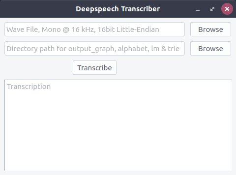

## Transcribing longer audio clips

The Command and GUI tools perform transcription on long wav files.
They take in a wav file of any duration, use the WebRTC Voice Activity Detector (VAD)
to split it into smaller chunks and finally save a consolidated transcript.

### 0. Prerequisites
Setup your environment

```
~/Deepspeech$ sudo apt install virtualenv
~/Deepspeech$ cd examples/vad_transcriber
~/Deepspeech/examples/vad_transcriber$ virtualenv -p python3 venv
~/Deepspeech/examples/vad_transcriber$ source venv/bin/activate
(venv) ~/Deepspeech/examples/vad_transcriber$ pip3 install -r requirements.txt
```

### 1. Command line tool

The command line tool processes a wav file of any duration and returns a trancript
which will the saved in the same directory as the input audio file.

The command line tool gives you control over the aggressiveness of the VAD.
Set the aggressiveness mode, to an integer between 0 and 3.
0 being the least aggressive about filtering out non-speech, 3 is the most aggressive.

```
(venv) ~/Deepspeech/examples/vad_transcriber
$ python3 audioTranscript_cmd.py --aggressive 1 --audio ./audio/guido-van-rossum.wav --model ./models/0.3.0/


Filename                       Duration(s)          Inference Time(s)    Model Load Time(s)   LM Load Time(s)
sample_rec.wav                 13.710               20.797               5.593                17.742

```

**Note:** Only `wav` files with a 16kHz sample rate are supported for now, you can convert your files to the appropriate format with ffmpeg if available on your system.

    ffmpeg -i infile.mp3  -ar 16000 -ac 1  outfile.wav

### 2. Minimalistic GUI

The GUI tool does the same job as the CLI tool. The VAD is fixed at an aggressiveness of 1.
The output is displayed in the transcription window and saved into the directory as the input
audio file as well.

```
(venv) ~/Deepspeech/examples/vad_transcriber
$ python3 audioTranscript_gui.py

```




#### 2.1. Sporadic failures in pyqt
Some systems have encountered **_Cannot mix incompatible Qt library with this with this library_** issue.
In such a scenario, the GUI tool will not work. The following steps is known to have solved the issue in most cases
```
(venv) ~/Deepspeech/examples/vad_transcriber$ pip3 uninstall pyqt5
(venv) ~/Deepspeech/examples/vad_transcriber$ sudo apt install python3-pyqt5 canberra-gtk-module
(venv) ~/Deepspeech/examples/vad_transcriber$ export PYTHONPATH=/usr/lib/python3/dist-packages/
(venv) ~/Deepspeech/examples/vad_transcriber$ python3 audioTranscript_gui.py

```
